# 水平集指导区域特征修正的眼球血管分割  
# Level Set Guided Region Prototype Rectification Network for Retina Vessel Segmentation

## 文章 Paper

Our article has been accepted by BSPC.

Yifei Liu, Qingtian Wu, Xueyu Liu, Junyu Lu, Zhenhuan Xu, Yongfei Wu, and Shu Feng. "Level set guided region prototype rectification network for retinal vessel segmentation".Biomedical Signal Processing and Control 87 (2024): 105428.

Link：[https://www.sciencedirect.com/science/article/pii/S1746809423008613](https://www.sciencedirect.com/science/article/pii/S1746809423008613)

## 简介 Introduction

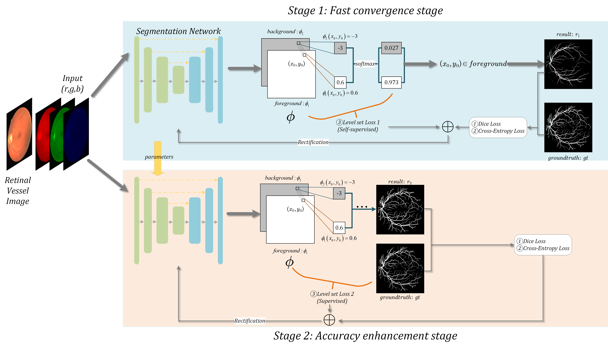

| Image                    | Ground Truth                | Unet                       | Unet+Ours                     | Att-Unet                      | Att-Unet+Ours                    |
| ------------------------ | ------------------------ | ------------------------ | ------------------------ | ------------------------ | ------------------------ |
|  |  | 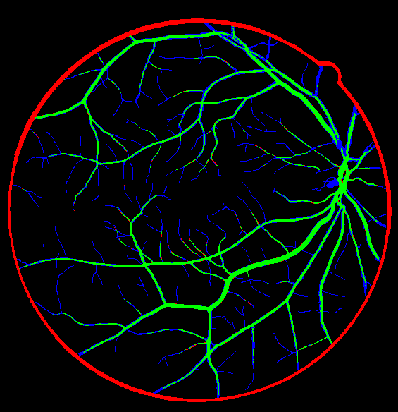 | 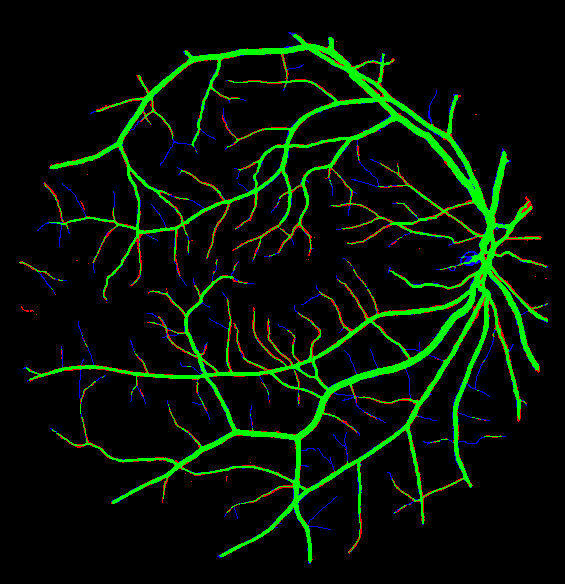 | 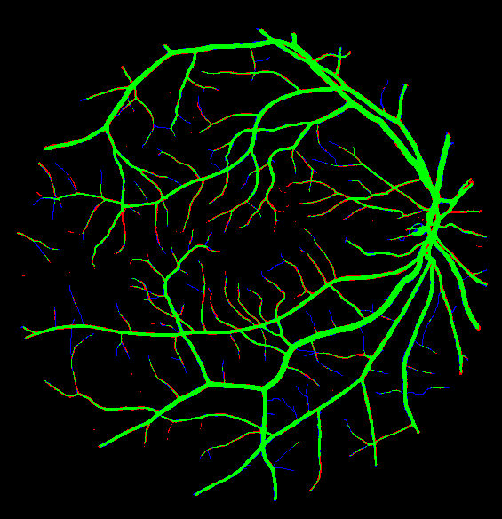 | 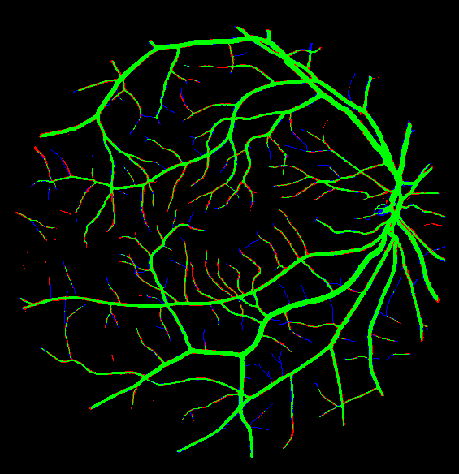 |
| 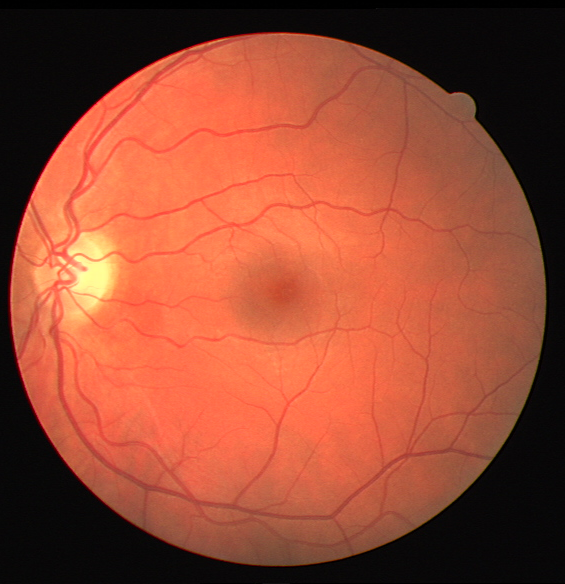 |  | 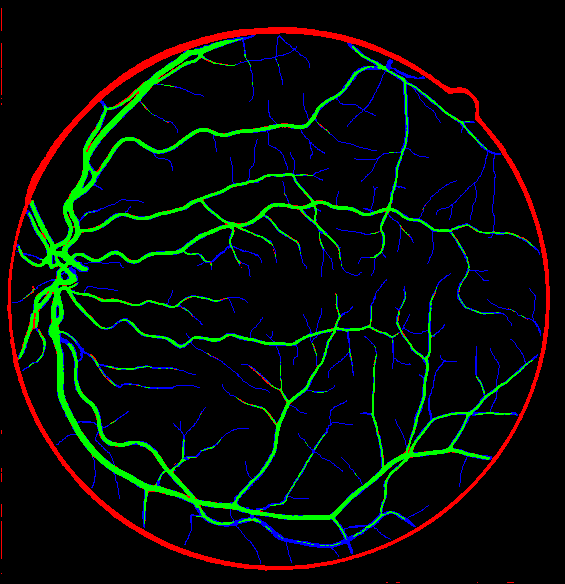 |  |  | 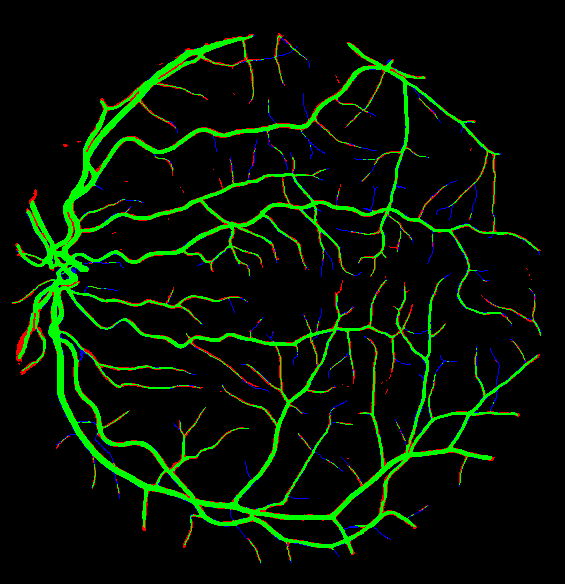 |
|  |  | 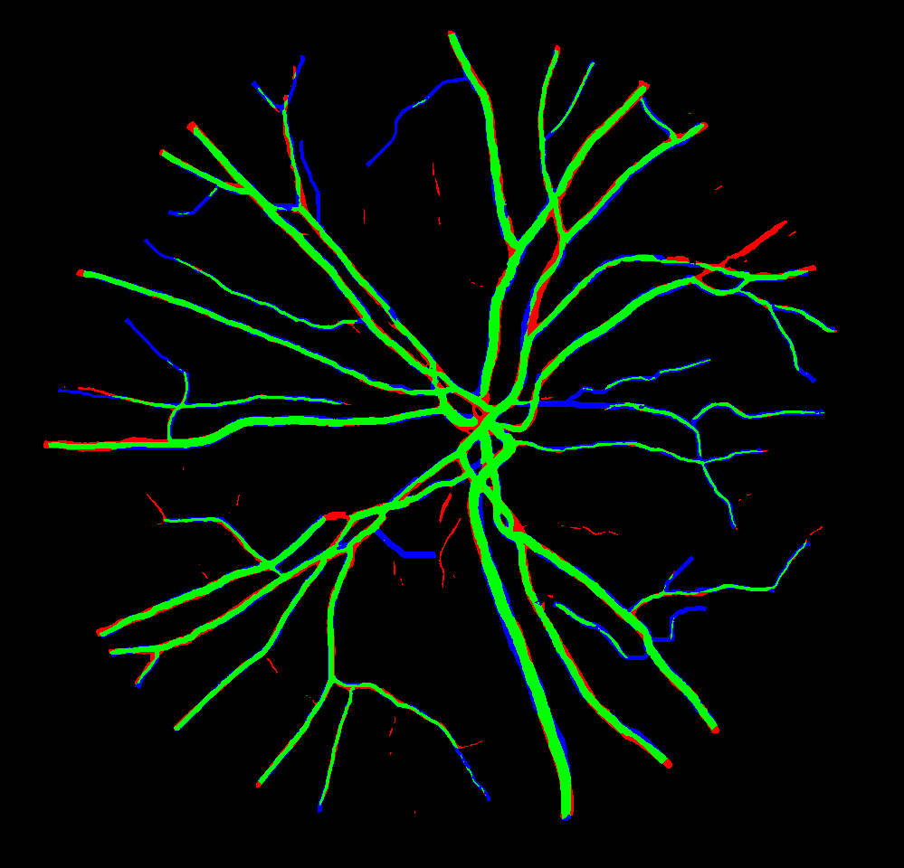 | 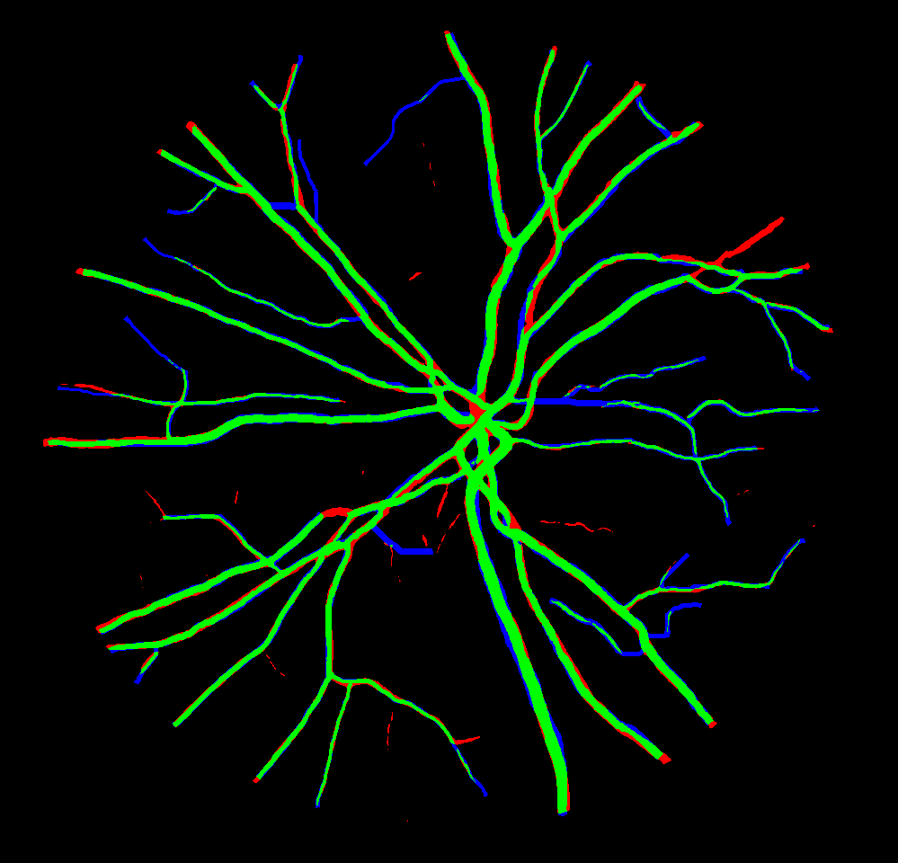 |  | 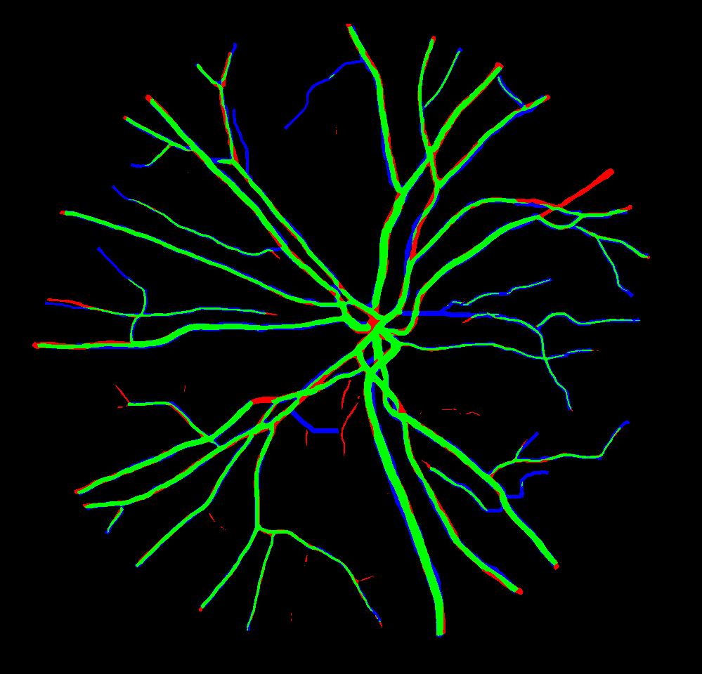 |


## 更新日志 Updates

2022/4/25: basic version (containing U-Net model & DRIVE dataset)

2022/5/2: add self-supervised & supervised level set loss

2022/5/13: add support of R2U-Net, Attetion-UNet, R2Attention-UNet

2022/5/20: add support of Chase_db1 dataset

2022/5/31: add support of SAUnet

2022/6/1: add a mixture of various models

2022/10/24: add support of RITE dataset

More...


## 环境 Requirements

本项目需要的环境极简。

This project requires a very minimal setting.

- Pytorch (Including Torchvision)
- Pillow
- matplotlib

Our project supports windows (windows 10/11) & linux (Ubuntu 20.04)  
Note: In Windows, python or anaconda (venv) should not in C:\\, which may cause authority error.


## 结果 Results

本表格记录了目前使用此种方法在该数据集上本人训练出的最好结果。

This table shows the greatest results I've gotten so far using my training strategy on the datasets.

| Dataset   | Method                     | Accuracy/F1 score/mIoU                   
| --------- | -------------------------- | -----------------------------------------
| DRIVE     | Unet (2015)                | 0.9283/0.7561/0.6518                      
| DRIVE     | Unet+Ours                  | 0.9688(↑)/0.8422(↑)/0.8323(↑)             
| DRIVE     | R2-Unet (2018)             | 0.9711/0.8266/0.8384                     
| DRIVE     | R2-Unet+Ours               | 0.9708(↓)/0.8295(↑)/0.8389(↑)             
| DRIVE     | Attention-Unet (2018)            | 0.9687/0.8420/0.8310                      
| DRIVE     | Attention-Unet+Ours              | **0.9735(↑)**/**0.8430(↑)**/**0.8502(↑)** 
| DRIVE     | R2Attention-Unet (2018)          | 0.9700/0.8161/0.8290                     
| DRIVE     | R2Attention-Unet+Ours            | 0.9623(↓)/0.7488(↓)/0.7813(↓)            
| DRIVE     | SA-UNet(lightweight)(2021) | 0.9697/0.8241/0.8343                     
| DRIVE     | SA-UNet(lightweight)+Ours  | 0.9714(↑)/0.8339(↑)/0.8423(↑)            
| Chase_db1 | Unet (2015)                | 0.9720/0.7980/0.8175                     
| Chase_db1 | Unet+Ours                  | 0.9724(↑)/**0.8002(↑)**/0.8190(↑)    
| Chase_db1 | Attention-Unet (2018)            | 0.9720/0.7990/0.8182                     
| Chase_db1 | Attention-Unet+Ours              | **0.9724(↑)**/0.8000(↑)/**0.8190(↑)**
| Chase_db1 | SA-UNet(lightweight)(2021) | 0.9700/0.7857/0.8080                   
| Chase_db1 | SA-UNet(lightweight)+Ours  | 0.9704(↑)/0.7912(↑)/0.8120(↑)          
| Chase_db1 | SA-UNet(complex)           | 0.9715/0.7971/0.8165                     
| Chase_db1 | SA-UNet(complex)+Ours      | 0.9717(↑)/0.7989(↑)/0.8179(↑)             


## 运行方法 Usage

```bash
 # read usage
 python trainLSF.py --help
```

Note: Our proposed level set loss is in /src/loss.py


### 训练 Train

- 修改合适的超参数，然后再进行训练。

- **(Important) Modify the hyperparameters, and then train.**

- 保持DRIVE、CHASE\_DB1和RITE的默认文件结构，然后指定数据集的文件路径。

- Keep the default file structure for DRIVE, CHASE\_DB1, and RITE, and then specify the file path.

They are in **hyper_parameters.py**

```bash
python trainLSF.py
```


### 结果 Inference

- 修改合适的超参数，然后生成结果。

- Modify the hyperparameters and generate the results.

They are also in **hyper_parameters.py**

```bash
python inference.py
```


 ### 使用bash训练 Training via bash
 
There is an example in /execute_example.sh in this project, you can alter it and rename it to /run.sh, and then train it on the server.

```bash
# 后台运行
nohup bash run.sh > run.log 2>&1 &

# 查找该进程
ps -aux | grep run.sh
```

