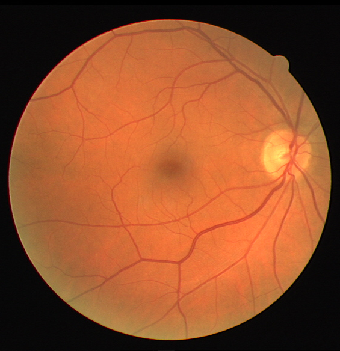
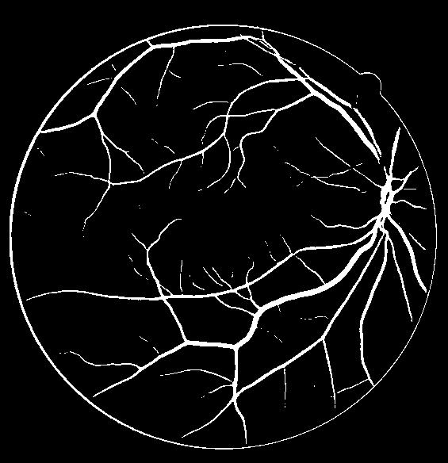
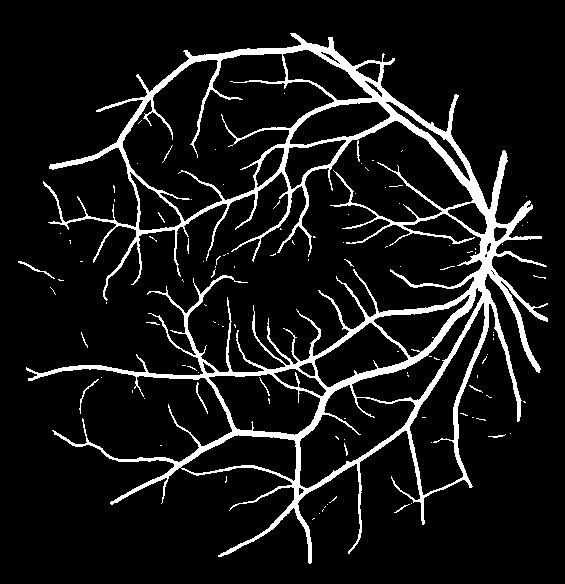
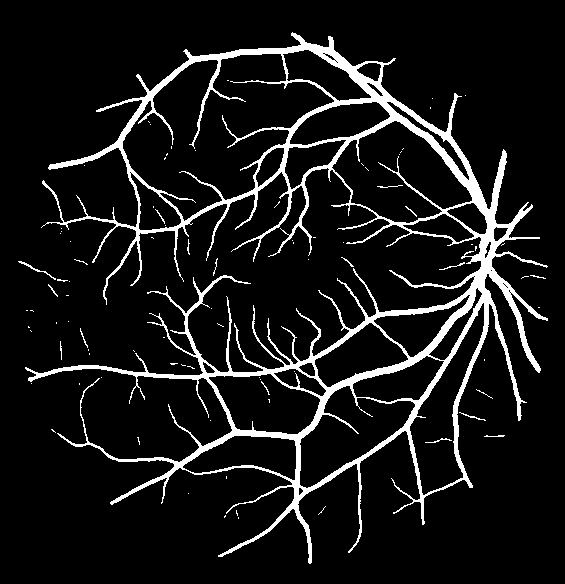
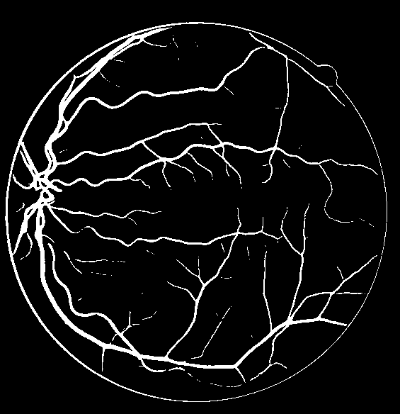
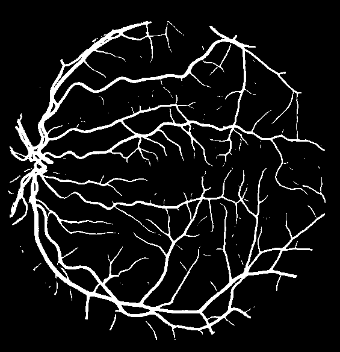
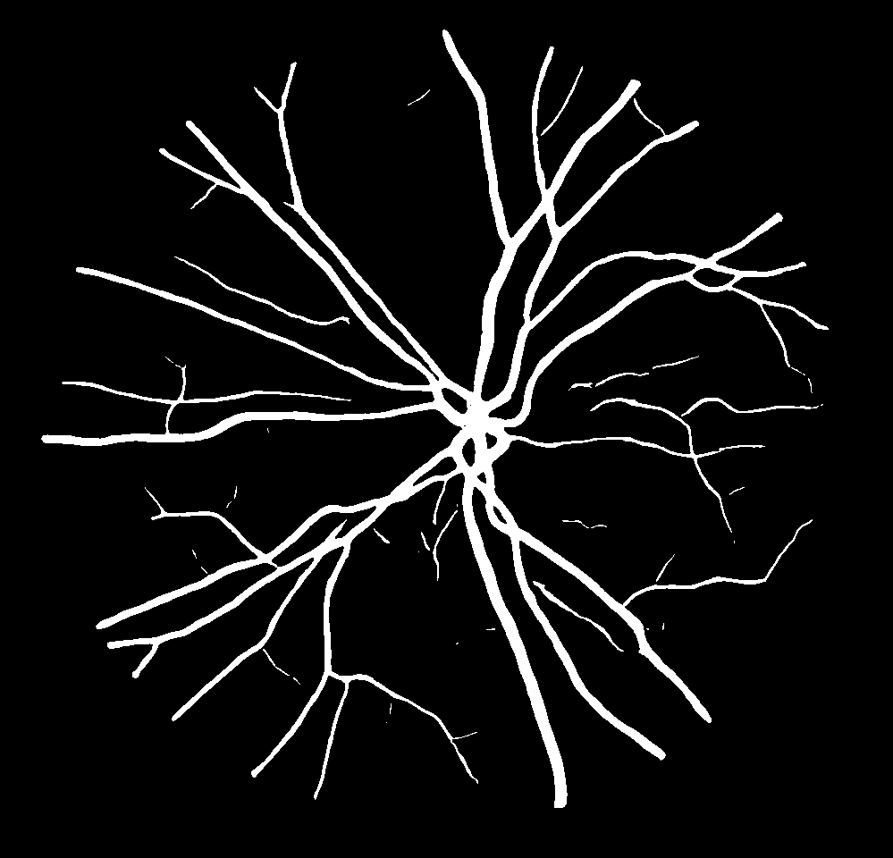
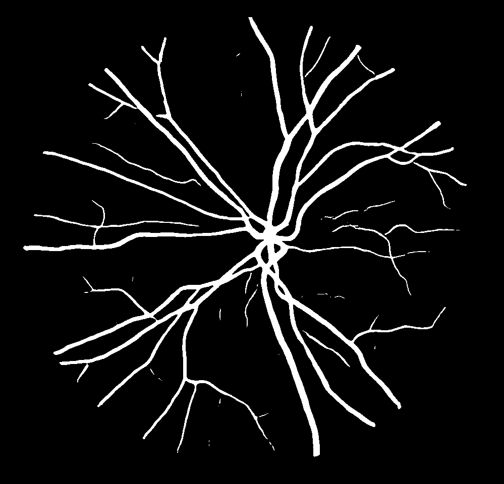

# 使用水平集改良的血管分割(Improved vessel segmentation approach using the level-set function)

## 简介 Introduction

| Image                    | Ground Truth                | Unet                       | Unet+Ours                     | Att-Unet                      | Att-Unet+Ours                    |
| ------------------------ | ------------------------ | ------------------------ | ------------------------ | ------------------------ | ------------------------ |
|  |  |  |  |  |  |
|  |  |  |  |  |  |
|  |  |  |  |  |  |


## 更新日志 Updates

2022/4/25: basic version (containing unet model & DRIVE dataset)

2022/5/2: add mum-ford loss

2022/5/13: add support of r2unet, attetion-unet, r2attention-unet

2022/5/20: add support of Chase_db1 dataset

2022/5/31: add support of SAUnet

2022/6/1: add a mixture of various models

More...


## 环境 Requirements

本项目需要的环境极简。

This project requires a very minimal setting.

- Pytorch (Including Torchvision)
- Pillow
- matplotlib


## 结果及权重 Results & Checkpoints

本表格记录了目前使用此种方法在该数据集上本人训练出的最好结果。

This table shows the greatest results I've gotten so far using my training strategy on the datasets.

| Dataset   | Method                     | Accuracy/F1 score/mIoU                    | Checkpoint     | Log            |
| --------- | -------------------------- | ----------------------------------------- | -------------- | -------------- |
| DRIVE     | Unet (2015)                | 0.9283/0.7561/0.6518                      | coming soon... | coming soon... |
| DRIVE     | Unet+Ours                  | 0.9688(↑)/0.9032(↑)/0.8323(↑)             |                |                |
| DRIVE     | R2-Unet (2018)             | 0.9711/0.9071/0.8384                      |                |                |
| DRIVE     | R2-Unet+Ours               | 0.9708(↓)/0.9075(↑)/0.8389(↑)             |                |                |
| DRIVE     | Att-Unet (2018)            | 0.9687/0.9024/0.8310                      |                |                |
| DRIVE     | Att-Unet+Ours              | **0.9731(↑)**/**0.9148(↑)**/**0.8499(↑)** |                |                |
| DRIVE     | R2Att-Unet (2018)          | 0.9700/0.9011/0.8290                      |                |                |
| DRIVE     | R2Att-Unet+Ours            | 0.9623(↓)/0.8718(↓)/0.7813(↓)             |                |                |
| DRIVE     | SA-UNet(lightweight)(2021) | 0.9697/0.9047/0.8343                      |                |                |
| DRIVE     | SA-UNet(lightweight)+Ours  | 0.9714(↑)/0.9099(↑)/0.8423(↑)             |                |                |
| Chase_db1 | Unet (2015)                | 0.9720/0.8929/0.8175                      |                |                |
| Chase_db1 | Unet+Ours                  | 0.9724(↑)/0.8941(↑)/0.8190(↑)             |                |                |
| Chase_db1 | Att-Unet (2018)            | 0.9720/0.8936/0.8182                      |                |                |
| Chase_db1 | Att-Unet+Ours              | **0.9724(↑)**/**0.8941**(↑)/**0.8190(↑)** |                |                |
| Chase_db1 | SA-UNet(lightweight)(2021) | 0.9700/0.8863/0.8080                      |                |                |
| Chase_db1 | SA-UNet(lightweight)+Ours  | 0.9704(↑)/0.8894(↑)/0.8120(↑)             |                |                |
| Chase_db1 | SA-UNet(complex)           | 0.9715/0.8923/0.8165                      |                |                |
| Chase_db1 | SA-UNet(complex)+Ours      | 0.9717(↑)/0.8934(↑)/0.8179(↑)             |                |                |


## 项目结构 Structure

```shell
+--execute_example.sh
+--hyper_parameters.py
+--inference.py # Inference the model.
+--models # Network to use.
|      +--attunetplus.py
|      +--fcn.py
|      +--pfan.py
|      +--r2unet.py
|      +--sa_unet.py
|      +--unet.py
|      +--__init__.py
+--readme.md
+--src
|      +--get_transforms.py
|      +--loss.py # Loss function of the project.
|      +--__init__.py
+--steps # Steps of training.
|      +--make_data.py
|      +--make_data_inference.py
|      +--make_net.py
|      +--train_eval_model.py
|      +--__init__.py
+--trainLSF.py
+--utils # Some utils.
|      +--emailSender.py
|      +--eval_utils.py
|      +--handy_functions.py
|      +--metric_logger.py
|      +--result_analysis.py
|      +--timer.py
|      +--transforms.py
|      +--__init__.py
```


## 运行方法 Usage

```bash
 # read usage
 python trainLSF.py --help
```


### 训练 Train

- 修改合适的超参数，然后进行训练。

- Modify the hyperparameters, and then train.

They are in **hyper_parameters.py**

```bash
python trainLSF.py
```


### 结果 Inference

- 修改合适的超参数，然后生成结果。

- Modify the hyperparameters and generate the results.

They are also in **hyper_parameters.py**

```
python inference.py
```


 ### 批量训练 Batch training

```bash
# 后台运行
nohup bash run.sh > run.log 2>&1 &

# 查找该进程
ps -aux | grep run.sh
```

